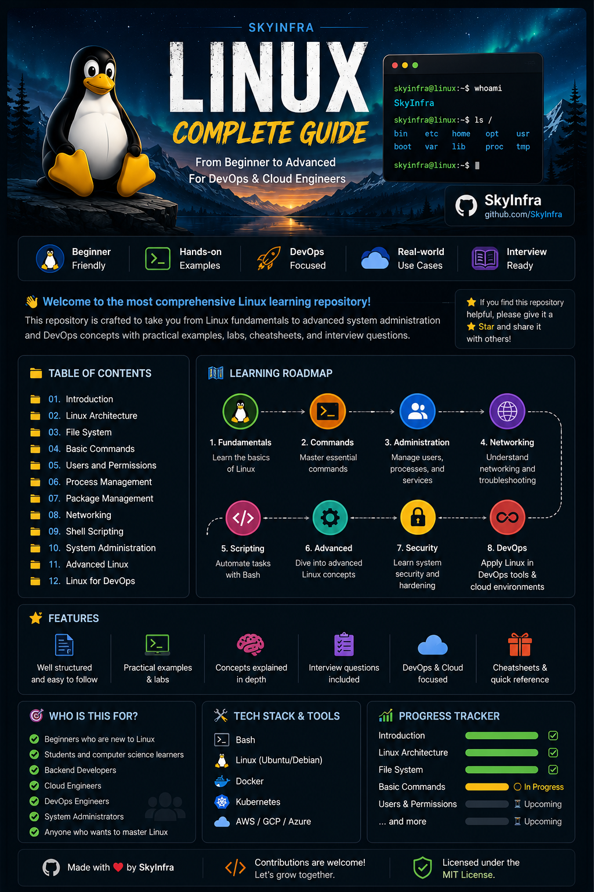

<p align="center">
  
</p>

<h1 align="center">🐧 Linux Complete Guide</h1>

<p align="center">
A comprehensive Linux learning repository covering everything from beginner to advanced with practical examples, hands-on labs, interview questions, and DevOps-focused content.
</p>

<p align="center">
  
  
  
  
</p>

---

# 📖 About

This repository is designed to help anyone master Linux from the ground up.

Whether you're a beginner, backend developer, cloud engineer, or aspiring DevOps engineer, this guide provides structured learning with clear explanations, practical examples, and real-world use cases.

---

# 🚀 Learning Roadmap

- ✅ Linux Fundamentals
- ✅ Operating System Basics
- ✅ Linux Architecture
- ✅ Linux File System
- ✅ Basic Linux Commands
- ✅ Users & Permissions
- ✅ Process Management
- ✅ Package Management
- ✅ Networking
- ✅ Shell Scripting
- ✅ System Administration
- ✅ Advanced Linux
- ✅ Linux Security
- ✅ Linux for DevOps

---

# 📂 Repository Structure

```text
linux-complete-guide
│
├── Assets
├── 01-Introduction
├── 02-Linux-Architecture
├── 03-File-System
├── 04-Basic-Commands
├── 05-Users-and-Permissions
├── 06-Process-Management
├── 07-Package-Management
├── 08-Networking
├── 09-Shell-Scripting
├── 10-System-Administration
├── 11-Advanced-Linux
└── 12-Linux-for-DevOps
```

---

# 🎯 Who Is This Repository For?

- 🎓 Students
- 💻 Backend Developers
- ☁️ Cloud Engineers
- 🚀 DevOps Engineers
- 🖥️ System Administrators
- 🐧 Anyone who wants to master Linux

---

# ✨ What You'll Find

- 📚 Beginner-friendly explanations
- 🧠 In-depth concepts
- 💻 Practical terminal examples
- 🧪 Hands-on labs
- 📊 Diagrams and illustrations
- ❓ Interview questions
- 🚀 DevOps-focused examples
- 📝 Best practices

---

# ⭐ Goal

Build one of the most comprehensive Linux learning repositories on GitHub while learning Linux from beginner to advanced.

---

## 🤝 Contributing

Suggestions and improvements are always welcome.

If you find mistakes or have ideas to improve this repository, feel free to open an issue or submit a pull request.

---

## 📜 License

This repository is licensed under the MIT License.